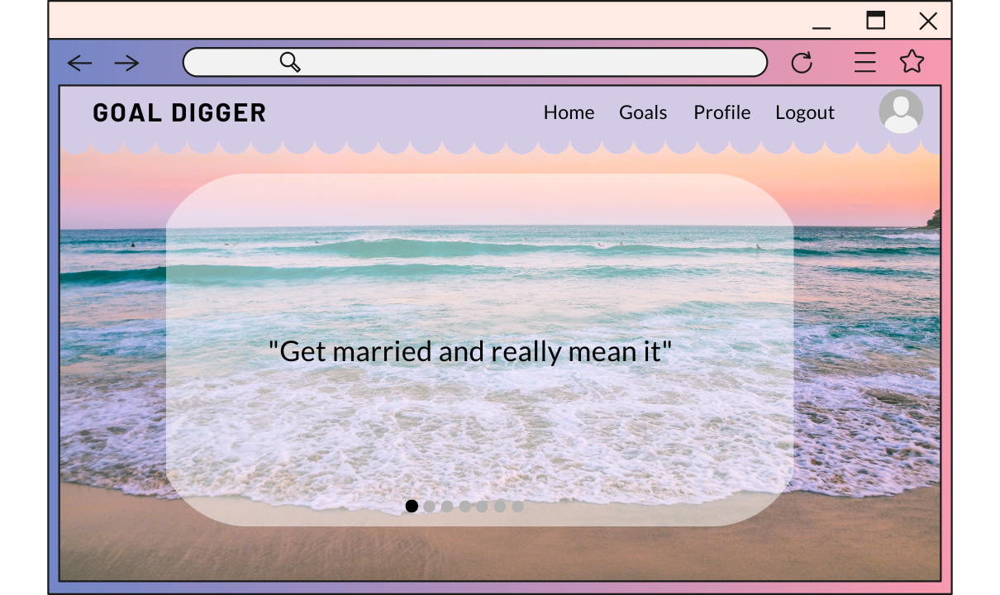
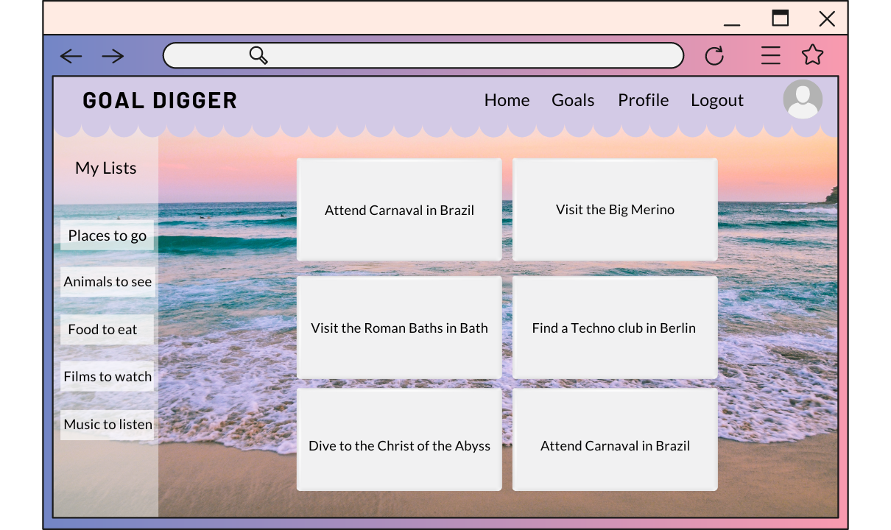
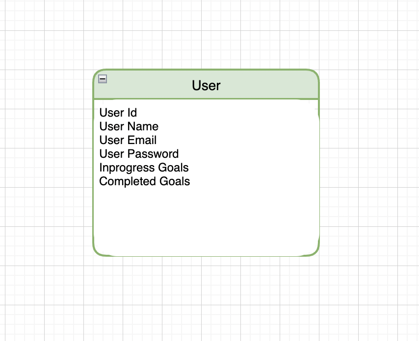

# goal-digger

Bucket List Application
goal-digger.netlify.app

## Description

A one stop shop for all your bucket list ideas! Plan your future goals and keep track of those completed. 
Get inspired by a random bucket list idea or add your own item.

## Wireframe

- Landing page 1 - Bucket list options

- Landing page 2 - more options

- Profile View - view your basic profile information and your lists

- Goals View - view your saved goals and lists

## ERD

## RESTful Routes

### Bucketlist Goals

| HTTP METHOD (_Verb_) | URL (_Nouns_) | CRUD | Response                                              | Notes |
| -------------------- | ------------- | ---- | ----------------------------------------------------- | ----- |
| GET                  | /             | R    | show page of bucketlist items from the bucketlist API |       |

### Users

| HTTP METHOD (_Verb_) | URL (_Nouns_) | CRUD | Response                                                   | Notes |
| -------------------- | ------------- | ---- | ---------------------------------------------------------- | ----- |
| POST                 | /users        | C    | create new user                                            |       |
| GET                  | /users/:id    | R    | show user's profile including their goal lists             |       |
| PUT                  | /users/:id    | U    | edit the user's profile                                    |       |
| POST                 | /users/login  | C    | accept a payload of form data and use it to login the user |       |

### Bucketlist Goals

| HTTP METHOD (_Verb_) | URL (_Nouns_)  | CRUD | Response                                       | Notes |
| -------------------- | -------------- | ---- | ---------------------------------------------- | ----- |
| DELETE               | /goals/:goalId | D    | remove goal from user's in progress bucketlist |       |
| POST                 | /goals         | C    | create a new goal                              |       |
| PUT                  | /goals/:goalId | U    | edit a goal                                    |       |

## User Stories

- As an unregistered user, I would like to sign up with email and password.
- As a registered user, I would like to sign in with email and password.
- As a signed in user, I would like to change password.
- As a signed in user, I would like to sign out.
- As a signed in user, I would like to create a list item with a title and description.
- As a signed in user, I would like to update my list item's title and description.
- As a signed in user, I would like to delete my list item.
- As a signed in user, I would like to see all my list items but not other users'.
- As a signed in user, I would like to cross off items to complete them.

## MVP

- Set up react client with routes
- Set up mongoose server
- Set up user authentication with password encryption
- Set up CRUD functionality for user
- Set up CRUD functionality for bucket list goal
- Add a carousel on the home page that rotates through different bucket list ideas
- Show a page of bucket list ideas
- Show the users profile with all bucket list goals they have been added.

## Stretch Goals

- See other peoples profiles with their added bucket list goals
- Be able to favorite other's bucket list goals and add that to the users own profile list
- Be able to leave comments on goals

## Tech Stack
- MERN (Mongoose, Express, React, Node.js)
- Axios
- CSS: combination of vanilla CSS and React Bootstrap
- HTML 
- API : https://api-ninjas.com/api/bucketlist - you will need to register for an API key

## Deployment Instructions
1. Fork and clone repository 
2. In your terminal run <npm install>  (this will install all needed packages)
3. You will want to install a couple of files for functionality
    - In  your terminal touch <.git.ignore> and <.env>
    - To your git ignore file add: node_modules and .env
    - In your .env file you will need to add an ENC_KEY and your API key 
        -ex: ENC_KEY = "super secret password string"
        - We highly recommend placing your API key on the server end
4. Run NPM start and start your coding 

## Post Project Reflection
- This project was our teams first time working on a group development project. We feel we have grown and learned a lot about collaboration. We have had some challenges (we're looking at you Git Hub) but we created a project we are all proud of. 
- Collaboration Strategies: we used a spreadsheet to plan out our project and assign individual tasks. We also communicated via Slack to ensure we were all on the same page
- Challenges and takeaways: One of the bigest challenges we faced was not deviating from our assigned tasks. When working on a solo project you tend to hop back and forth between files and change things. It is not advisable in a group project to do that.  Another of our challenges was managing the work flow of Git hub when working with a team. We had a lot of merge issues and misunderstanding of the neccessary steps but by the end of the project we had the process down.
- Future Plans: we would like to add functionality for users to see other users bucket list items, as well as update the styling- Giant shoutout to Megan for her awesome CSS.

